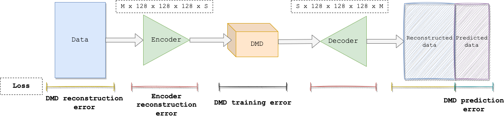

# GLAPPO

GLAPPO (**G**eneric **L**inear **A**lgebra **P**orting of **P**yDMD [**O**ngoing]) is the
twin repository of PyDMD/PyDMD#299, which enables support for generic linear
algebra frameworks in PyDMD.

### Table of contents

- [PyDMD](#pydmd)
- [What is *GLAPPO*](#what-is-glappo)
- [Progress](#progress)
- [Developers guide](#developers-guide)
- [Results -- DLDMD](#results----dldmd)
- [References](#references)

## PyDMD

PyDMD is the widest open source framework for
[Dynamic Mode Decomposition (DMD)](https://en.wikipedia.org/wiki/Dynamic_mode_decomposition).
Along with the implementation of 14 DMD variants, PyDMD provides tools for DMD analysis (plotting,
eigenvalues and mode manipulation/analysis), and development tools to extend the
framework with custom code, e.g. new DMD variants or tailored post-processing.

## What is *GLAPPO*

The aim of **GLAPPO** is to make PyDMD agnostic on the linear algebra framework.


This architecture enable harvesting the peculiar features of each linear algebra framework, without the need
of re-implementing the DMD algorithms in the particular interface offered by the framework.

### DMD on GPU

GPU accelerators are widely used to boost intensive linear algebra algorithms, we expect that the ability to run seamlessly
PyDMD scripts on GPU would enable acceleration and increase the scale of possible experiments.

### Backpropagation through DMD

So far, PyDMD has been a kind-of _black hole_ for backpropagation, i.e. gradient information used to be eaten and never
given back. Thanks to PyDMD/PyDMD#299 PyDMD becomes part of the backpropagation graph, thus enabling differentiation
through the DMD algorithm for all the DMD variants ported to the new generic linear algebra framework.

### Batched/tensorized DMD

Many linear algebra frameworks (e.g. PyTorch) dedicate the leading axis to the _batch_ dimension. This means that
any operation (be it SVD, eigendecomposition, mean) is applied independently to all the tensors resulting from
slices of the batch dimension, such that the size of the leading axis of the output is the same as the leading axis of
the input. In NumPy this can be achieved with a simple `for`-loop, at the cost of significantly worse performance
(more on this in `dmd-benchmark/`). Tensorized code is also much more idiomatic (less branching, less foreign constructs,
less unneeded variables).

Like all PyTorch functions, supported DMD variants now can be trained with tensors of size `(*, M, N)`, where `*` is called 
*batch dimension*. In order to enable batched training, you need to supply the additional parameter `batch=True` to `fit()`
(by default it is `false`).

The following snippets are equivalent:
```python
>>> X.shape()
(10, 100, 20)
>>> Y = dmd.fit(X, batch=True).reconstructed_data
```

```python
>>> Y = torch.stack([dmd.fit(Xi).reconstructed_data for Xi in X])
```

The benefit of tensorized training are:
- Performance boost;
- The DMD instance retains information on all the slices of `X`;
- Coinciseness.

## Progress
 
| Name            | GLAPPified         | Tensorized         |
|-----------------|--------------------|--------------------|
| BOPDMD          | :x:                | :x:                |
| CDMD            | :heavy_check_mark: | :heavy_check_mark: |
| dmd_modes_tuner | :heavy_check_mark: | :x:                |
| DMD             | :heavy_check_mark: | :heavy_check_mark: |
| DMDc            | :heavy_check_mark: | :x:                |
| FbDMD           | :heavy_check_mark: | :heavy_check_mark: |
| HankelDMD       | :heavy_check_mark: | :heavy_check_mark: |
| HAVOK           | :x:                | :x:                |
| HODMD           | :heavy_check_mark: | :heavy_check_mark: |
| MrDMD           | :heavy_check_mark: | :x:                |
| OptDMD          | :x:                | :x:                |
| ParametricDMD   | :x:                | :x:                |
| PIDMD           | :x:                | :x:                |
| RDMD            | :heavy_check_mark: | :heavy_check_mark: |
| SPDMD           | :x:                | :x:                |
| SubspaceDMD     | :heavy_check_mark: | :heavy_check_mark: |

## Implementation

The implementation step is clearly the most time consuming, as we need to rewrite the PyDMD framework
in a more general way leveraging linear algebra subroutines supported by all the target frameworks
(NumPy, PyTorch, ...).

This was achieved by defining a new set of
[classes](https://github.com/fAndreuzzi/PyDMD/tree/generic-linalg/pydmd/linalg) implementing
a common linear algebra interface. The DMD variants in PyDMD uses this common interface under the hood, and
concrete implementations of the interface are provided for the target frameworks as needed. Below we show a
snippet taken from those classes:

```python
# pydmd.linalg.linalg_base.py
class LinalgBase:
    @classmethod
    def svd(cls, X, *args, **kwargs):
        raise NotImplementedError

# pydmd.linalg.numpy_linalg.py
class LinalgNumPy(LinalgBase):
    @classmethod
    def svd(cls, X, *args, **kwargs):
        return np.linalg.svd(X, *args, **kwargs)

# pydmd.linalg.pytorch_linalg.py
class LinalgPyTorch(LinalgBase):
    @classmethod
    def svd(cls, X, *args, **kwargs):
        import torch

        return torch.linalg.svd(X, *args, **kwargs)
```

At the moment we intent to support about 40 linear algebra functions.

An additional challenge was posed by batched/tensorized training. The goal here was to support tensorized
training avoiding overcomplicated code with tons of conditional branches (`if X.ndim == 4:`). This was
mainly achieved thanks to the `...` operator in PyTorch and to same careful swapping of tensor axes. As
we're going to see in the benchmark this sub-step is fundamental to fully support Deep Learning on DMD,
as the performance toll imposed otherwise would have made unfeasible any kind of training.

## Developers guide

A *brief* guide for PyDMD developers on how to leverage GLAPPO for new and old PyDMD codes.

### Things to keep in mind

Due to the strong requirements of `torch.mul` and `torch.linalg.multi_dot`, the implementation of these
two functions in `pytorch_linalg.py` forces a cast to the biggest **complex** type found in the argumnets.
We decided to take this path instead of placing the burden on user/implementors since for some algorithms
it's hard to control consistently whether the output is complex or real (e.g. `torch.linalg.eig`) and casts
will happen internally quite often. This damages memory efficiency and performance, but ensures correct 
results. It will be subject of investigation if we receive complains from our users.

This kind of casts is logged, in order to get the logs enable the `INFO` logging level:
```python
import logging
logging.basicConfig(level=logging.DEBUG)
```

### Guidelines

**Calling `build_linalg_module()`**

Be careful on the argument on which you call `build_linalg_module()`. It may happen that some NumPy arrays
are created *en passant* to be used as arguments for more complicated functions. These are not good candidates
for `build_linalg_module()`, as they clearly do not convey information about user preferences on array typing.

**Check aggressively...**

Always check that the user is providing appropriate array pairs/triplets in PyDMD entrypoints (e.g. `fit()`).
`linalg.py` provides some utility functions (`is_array(X)`, `assert_same_linalg_type(X,*args)`) to facilitate writing
this kind of checks.

**... but trust the team**

No need to check the output of internal functions like `DMDBase._optimal_dmd_matrices()`. This clutters the
code and provides no additional value, our PRs are carefully reviewed by developers from the core team of
PyDMD.

**Test!**

Test new and old code for all new possibilities introduced by GLAPPO, for instance tensorized training. There are
many examples in `tests`.

## Results -- DLDMD

We validated **GLAPPO** against DLDMD, a DMD variant which uses DL techniques to enhance the quality of reconstruction/prediction.
For the implementation check `src/dldmd.py` and `notebooks/dldmd.ipynb`.



### Reconstruction/prediction accuracy (VS standard DMD)

DLDMD performs much better than the standard DMD both in reconstruction and prediction, and is able to understand
the dynamic of the system much better than its simpler counterpart.


### Encoder/decoder pair

DLDMD uses an encoder/decoder pair whose goal is to map snapshots onto a latent space which should be as easy as possible
to interpret for DMD. We visualize the latent snapshots (left) along with their decoded version (right).


## References

- Alford-Lago, Daniel J., et al. "Deep learning enhanced dynamic mode decomposition." Chaos: An Interdisciplinary Journal of Nonlinear Science 32.3 (2022): 033116.
- Kutz, J. Nathan, et al. Dynamic mode decomposition: data-driven modeling of complex systems. Society for Industrial and Applied Mathematics, 2016.
- Demo, Nicola, Marco Tezzele, and Gianluigi Rozza. "PyDMD: Python dynamic mode decomposition." Journal of Open Source Software 3.22 (2018): 530.
